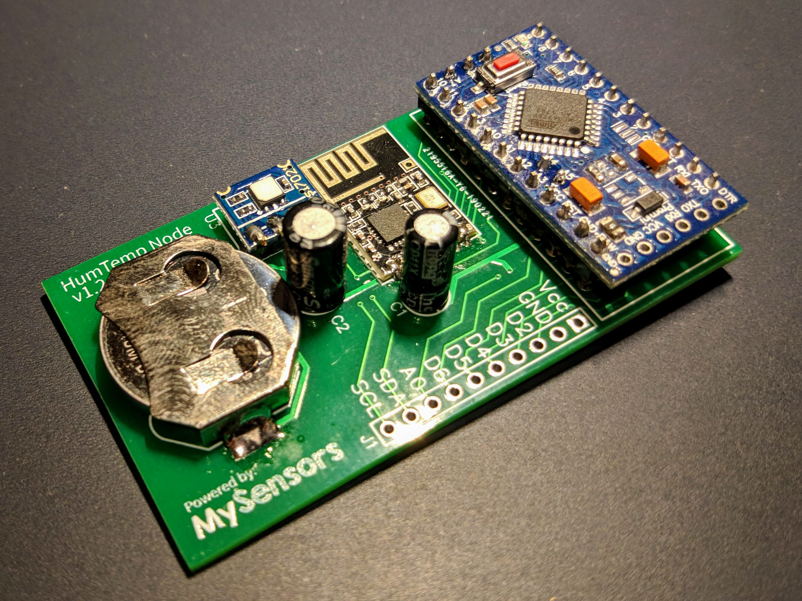
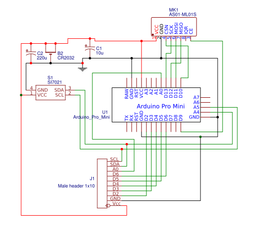
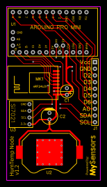
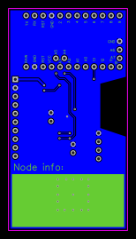

# HumTempNode

Small and easy to build [MySensors](https://www.mysensors.org/) temperature and humidity sensor based on [BlackCircleSensor](https://www.openhardware.io/view/411/BlackCircle-Sensor-High-WAF-TempHum-sensor).

## Result

## Extending the Arduino's Battery life

To be able to use the arduino with a coin cell battery, some steps are needed:

- Burn 1MHz ATMega328P 1MHz Bootloader with 1.8V BOD from [MiniCore](https://github.com/MCUdude/MiniCore).
- Unsolder on-board voltage regulator and power LED (You can keep the built-in LED in pin 13, it's useful for debugging).

For this sensor I used the 5V variant of the Arduino Pro mini, but the 3.3V one should work as well (Maybe even better!).

## Software

- Modify the provided [sketch](HumTempNode/HumTempNode.ino) to your liking (Static node id, battery level reporting...).
- Upload the sketch to the Arduino without the coin cell battery inserted.
- Unplug the Arduino from the FTDI cable and insert the battery.

## Hardware

### Schematic

### BOM:

| ID  | Name             | Designator | Footprint         | Quantity |
| --- | ---------------- | ---------- | ----------------- | -------- |
| 1   | Male header 1x10 | J1         | H10-2.54          | 1        |
| 2   | CR2032 holder    | B2         | CR2032 SMD HOLDER | 1        |
| 3   | Capacitor 10uF   | C1         | CAP5X7            | 1        |
| 4   | Capacitor 220uF  | C2         | CAP-D6.3XF2.5     | 1        |
| 5   | Arduino Pro Mini | U1         | ARDUINO_PRO_MINI  | 1        |
| 6   | SI7021           | S1         | SI7021 MODULE     | 1        |
| 7   | AS01-ML01S       | MK1        | NRF24L01_SMD+     | 1        |

### PCB Layout

You can download the Gerber files [here](HumTempNode.zip).
